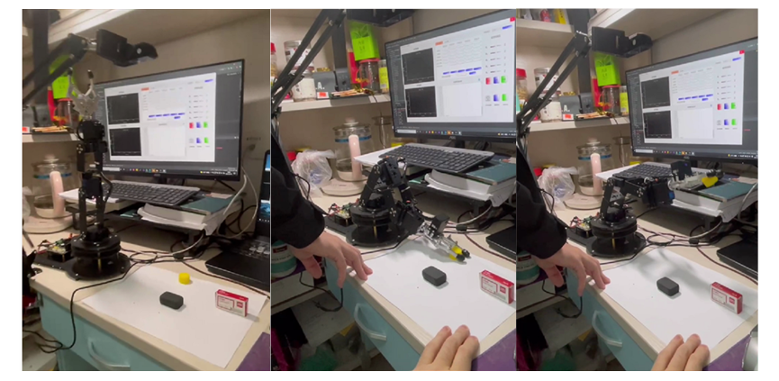

# 5 DoF Robot Trajectory Planning Contriol and Intelligent Interactive System

Acquired software copyright @2022

Functions:

- Forward and inverse kinematics solving and trajectory generating & planning
- Camera calibration based on Zhang Zhengyou's (checkerboard grid method) distortion correction
- Robotic arm target capturing based on Canny Edge Detection
- Hand keypoint detection and robot gesture interaction based on convolutional neural network
- Robotic arm bionic based on posture estimation
- Robot voice control based on natural language processing

UI

Calibration

RoI Selection and Egde Detection

Target Capture

Gesture Recognition and Interactive

    
    

Posture Estimation and Interactive

Voice Control

Trajectory Planning

